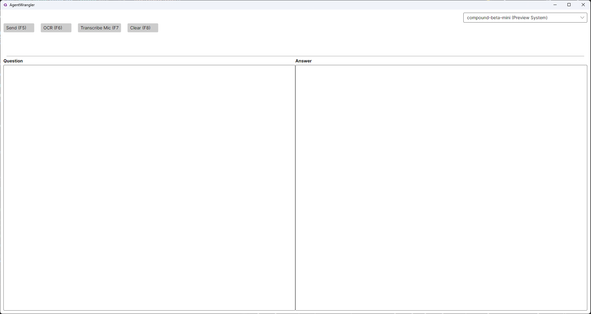

AgentWrangler
A cross-platform C# application developed in Visual Studio 2022 that leverages OCR to capture your entire screen, transcribes spoken or typed commands, and sends them to a Groq-powered language model for inference.

✨ Features

Screen OCR: Captures and extracts text from your entire screen.
Command Transcription: Transcribes spoken or typed commands with high accuracy.
LLM Inference: Sends transcribed commands and screen data to a Groq-powered language model for intelligent processing.
Cross-Platform: Built with .NET to support Windows, macOS, and Linux (currently tested on Windows only).

📸 Screenshots

📋 Requirements

Visual Studio 2022 with .NET SDK 6.0 or higher
Groq API Key: Obtain one at Groq Console
NuGet Packages: Automatically managed in the project’s .csproj file

🚀 Installation

Clone the Repository:
git clone https://github.com/your-repo/agentwrangler.git
cd agentwrangler

Open the Solution:

Launch Visual Studio 2022 and open the .sln file.

Restore NuGet Packages:

Visual Studio will prompt you to restore packages, or run:dotnet restore

🛠️ Usage

Select a Model:

Upon launching, choose a Groq model for inference from the available options.

Provide a Command:

Speak or type your command.
The application uses OCR to capture screen content and transcribes your command.

View Results:

The transcribed command and screen data are sent to the selected Groq model.
The model's response is displayed in the application interface.

🖥️ Platform Support

Tested: Windows
Untested: macOS, Linux (cross-platform support is implemented but not fully validated)

🔧 Development Notes

Groq Integration: The application relies on Groq for fast and efficient LLM inference. A valid API key is required.
OCR and Transcription: Screen content and transcribed commands are processed via Groq endpoints.
Platform Optimization: Currently optimized for Windows; testing on macOS and Linux is in progress.

🤝 Contributing
We welcome contributions! To get started:

Fork the repository.
Create a new branch:git checkout -b feature/your-feature

Commit your changes:git commit -m 'Add your feature'

Push to the branch:git push origin feature/your-feature

Open a pull request.

📜 License
This project is licensed under the MIT License.

📬 Contact
For questions or support, please:

Open an issue on the repository.
Email: viktor.faubl@gmail.com
